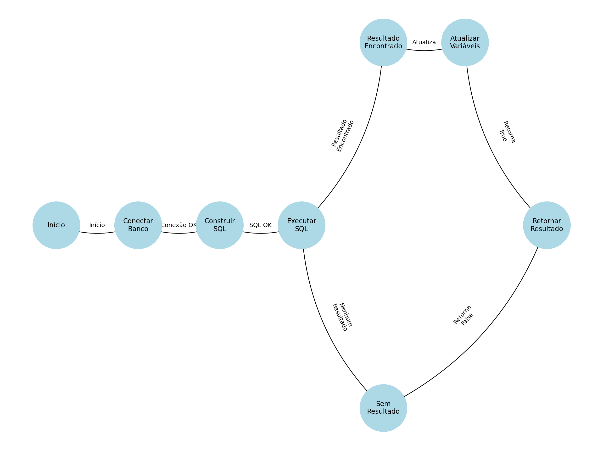

# **ETAPA 3: Critérios de Caixa Branca**

## Grafo de Fluxo
O grafo de fluxo foi criado para representar os pontos de decisão e os caminhos possíveis no método `verificarUsuario`. Ele está disponível como uma imagem anexada ao projeto.

## Numeração dos Pontos no Código
Os pontos do código foram numerados da seguinte forma:
1. **Início do método `verificarUsuario`.**
2. **Conexão com o banco de dados.**
3. **Construção da consulta SQL.**
4. **Execução da consulta SQL no banco de dados.**
5.1. **Resultado encontrado (`if rs.next()`).**
5.2. **Nenhum resultado encontrado.**
6. **Atualização das variáveis `nome` e `result`.**
7. **Retorno do método (`return result`).**

## Pontos de Entrada e Saída
- **Ponto de Entrada:** Os parâmetros `login` e `senha` fornecidos ao método.
- **Pontos de Saída:** 
  - Retorno `true` quando o usuário é validado.
  - Retorno `false` quando o usuário não é validado.

## Interligação dos Pontos
### Descrição das Arestas:
- **(1 → 2):** Fluxo do início para conexão com o banco.
- **(2 → 3):** Conexão com o banco bem-sucedida.
- **(3 → 4):** SQL construída com sucesso.
- **(4 → 5.1):** Resultado encontrado na execução SQL.
- **(4 → 5.2):** Nenhum resultado encontrado na execução SQL.
- **(5.1 → 6):** Atualização das variáveis com os dados do usuário.
- **(5.2 → 7):** Retorno do método sem resultados.
- **(6 → 7):** Retorno do método com sucesso.

## Complexidade Ciclomática
A complexidade ciclômica foi calculada com a fórmula:

\[
M = E - N + 2
\]

- **N (Nodos):** 8  
- **E (Arestas):** 9  

\[
M = 9 - 8 + 2 = 3
\]

**Resultado:** A complexidade ciclômica é **3**.

## Sequências de Caminhos
### Caminho 1:
- **Fluxo:** (1) → (2) → (3) → (4) → (5.1) → (6) → (7)  
- **Descrição:** O usuário e senha são válidos, resultando no retorno `true`.

### Caminho 2:
- **Fluxo:** (1) → (2) → (3) → (4) → (5.2) → (7)  
- **Descrição:** O usuário e senha são inválidos, resultando no retorno `false`.

### Caminho 3:
- **Fluxo:** (1) → (2) → Exceção ao tentar conectar ao banco de dados.  
- **Descrição:** Uma falha na conexão ocorre, e o método não consegue prosseguir, retornando sem sucesso.
